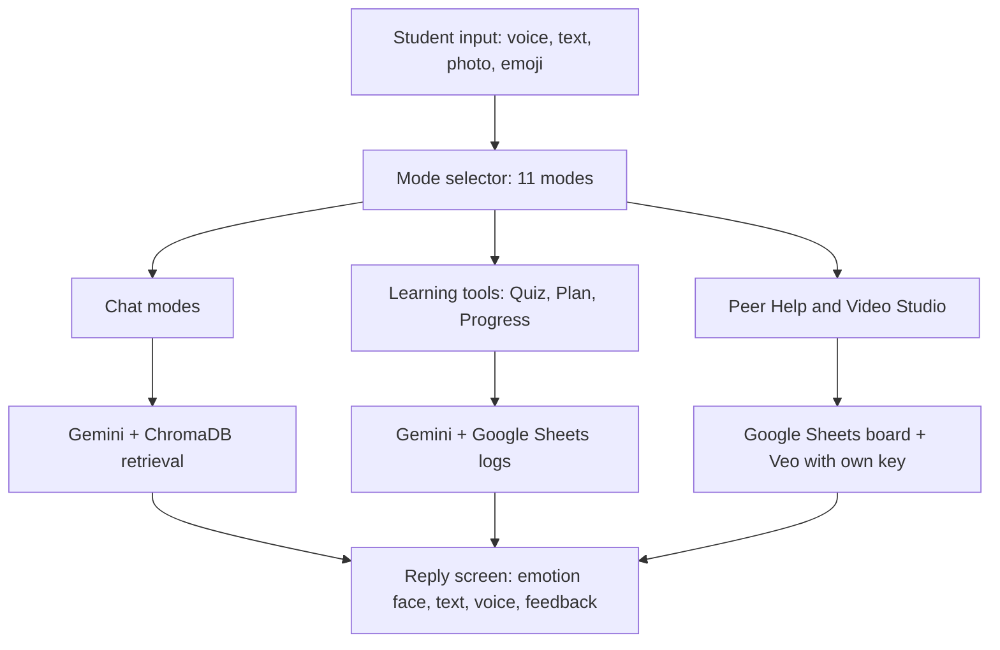

# 🧠 Cheat Mind

An emotion-aware AI study companion for WASSCE students in The Gambia. It listens, talks back, and reacts to how you feel.

**🔗 Live app:** https://emotionaiagent-bah-2006.streamlit.app/

> Despite the name, Cheat Mind is a **study and learning tool**. It helps students understand their subjects, practise exam questions and plan their revision. It is not a tool for cheating.


*Concept illustration of the idea: multimodal input (audio, text, video, uploads) goes into an emotion-aware AI engine, which produces a response. The real app flow is shown under [How it works](#how-it-works).*

---

## Why I built it

Thousands of students in The Gambia sit the WASSCE with no tutor, no study plan and nobody to ask when they get stuck. I built Cheat Mind so a student can study with an AI companion that explains, quizzes and encourages, in the languages they actually speak.

## Features

| Mode | What it does |
|---|---|
| 💙 **Comfort** | Emotionally supportive chat, with an optional calming tune or short story when the student seems low |
| 💻 **Coding Help** | Direct, code-first programming answers |
| 📚 **Study Help** | WASSCE tutoring in 12 subjects, with answer feedback and reference-grounded explanations (RAG) |
| 📝 **Quiz** | AI-generated WASSCE-style multiple-choice quizzes, scored with explanations |
| 📈 **Progress** | Accuracy per subject, score history and weak topics |
| 🗓️ **Study Plan** | Exam countdown and a day-by-day plan built around weak topics |
| 💰 **Sales & Business** | Practical advice for small business and side hustles |
| ✍️ **Poetry Help** | Craft feedback to help students write their own poems |
| 🤝 **Peer Help** | A shared class board where students post questions and reply to each other |
| 🎬 **Video Studio** | Short AI video clips with Veo (uses the student's own paid Gemini key) |
| 🌐 **General** | Anything else |

**Also included:**
- 🎙️ Voice input (the audio is sent straight to Gemini) and spoken replies
- 📷 Photo input, such as a textbook page
- 🌍 Reply languages: English, Wolof, Mandinka, Fula, Jola, Serer, Soninke, Jula and French
- ⏱️ Study timer with optional Google Sheets session logging
- 👍/👎 feedback on replies, logged for improvement
- 🌙 Dark mode, and chat export/import

## How it works
https://github.com/bahsulayman689-hash/emotion_ai_agent/blob/main/cheat_mind_app_workflow.png


Every chat reply comes back from Gemini as structured JSON (`transcript`, `reply`, `emotion`, `user_mood`). The app uses it to show the emotion face, speak the reply and decide when to gently offer a calming tune or story.

## Tech stack

- **App:** Python, Streamlit
- **AI:** Google Gemini (chat, quizzes, plans), Veo (video)
- **Retrieval:** ChromaDB with per-subject knowledge files
- **Storage:** Google Sheets via `gspread` (class board, quiz log, feedback, study log)
- **Voice:** `streamlit-mic-recorder` and the browser's built-in text-to-speech
- **Hosting:** Streamlit Community Cloud

## Run it locally

```bash
git clone https://github.com/bahsulayman689-hash/emotion_ai_agent.git
cd emotion_ai_agent
pip install -r requirements.txt
streamlit run cheat_mind_app.py
```

Get a free Gemini key at https://aistudio.google.com/app/apikey.

### Keys and secrets

Keys are never stored in the code. Create `.streamlit/secrets.toml` (already in `.gitignore`):

```toml
GEMINI_API_KEY = "your-key"

# Optional: shared Google Sheets for Peer Help, quiz log and feedback
GSHEET_URL = "https://docs.google.com/spreadsheets/d/XXXX/edit"
GCP_SERVICE_ACCOUNT = '''
{ paste the full service account JSON here }
'''
```

On Streamlit Cloud, paste the same content in **Settings → Secrets**. If no key is set, the sidebar shows a box where a user can paste their own.

For Google Sheets, create a service account, enable the Sheets and Drive APIs, and share your sheet with the service account's email as **Editor**.

## Project structure

```
├── cheat_mind_app.py          # the whole app
├── requirements.txt
├── *_kb.jsonl                 # subject knowledge files for retrieval
├── assets/
│   └── cheatmind-architecture.jpg
├── .streamlit/secrets.toml    # local keys (not committed)
└── README.md
```

## Notes

- Video Studio costs real money and always uses the student's own billed Gemini key, never the app's shared key.
- Comfort mode is a small lift, not a replacement for talking to someone you trust or a professional.

## Author

**Sulayman Bah** · ML/DL engineer from The Gambia
📧 bahsulayman689@gmail.com · 💼 [LinkedIn](https://linkedin.com/in/sulayman-bah-8a7096423) · 💻 [GitHub](https://github.com/bahsulayman689-hash)

Feedback and ideas are welcome. Open an issue or send a message.
## License

Released under the [MIT License](LICENSE). You are free to use, copy, modify and share this project, as long as the copyright notice stays.
